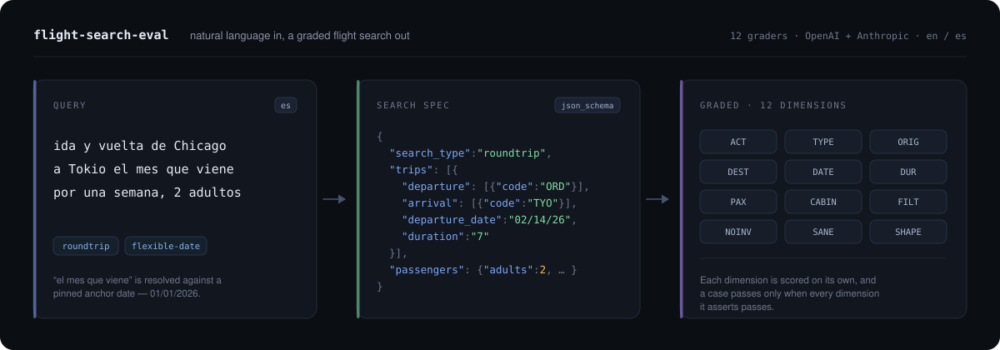

<p align="center">
  
</p>

<h1 align="center">flight-search-eval</h1>

<p align="center">
  An eval for the step <i>before</i> booking: turning one messy sentence into the flight search the traveler actually meant.
</p>

<p align="center">
  
  
  
  
  
  
  
</p>

---

The search specification a model produces — origin, destination, dates, duration, passengers, cabin,
filters — decides which itineraries a traveler is ever shown. Grading it is grading whether the model
understood which flights they meant. Not a booking benchmark: τ-bench and friends cover what happens
after. This covers what happens before.

26 cases in English and Spanish, 11 independent graders, one adapter interface per vendor.

## Run it

```bash
npm install
cp .env.example .env   # OPENAI_API_KEY, ANTHROPIC_API_KEY, GEMINI_API_KEY
npm run eval
```

Each run writes `results/<run-id>/<model>.json` and a self-contained `index.html` leaderboard —
no server, just open it. Re-render any run with `npm run dashboard -- results/<run-id>`.

Every call is appended to `results/<run-id>/<model>.partial.jsonl` as it lands, so a run that dies
halfway has lost nothing. `--run <run-id>` re-enters that directory: models that finished are
skipped, and the one that died calls only what it is still missing.

```bash
npm run eval -- --model claude-opus-5 --file es --repeats 3
```

| flag | |
| --- | --- |
| `--model <id>` | run one entry from the config instead of every one |
| `--file a,b` | dataset files to run, comma-separated; default is every one |
| `--limit N` | first N cases |
| `--concurrency N` | calls in flight at once, within one model (default 4) |
| `--run <run-id>` | resume into an existing results directory instead of opening a new one |
| `--repeats N` | same case N times — variance is a result too |
| `--today MM/DD/YYYY` | override the anchor date |
| `--prompt v6` | pick `prompts/<name>.txt` |

`OPENAI_API_KEY` is needed even for Anthropic-only runs: fuzzy locations are graded with embeddings.

## The 11 dimensions

Every grader returns pass, fail, or **not applicable** — and not-applicable stays out of the
denominator, so no model is rewarded or punished for a field its case says nothing about.
A case passes only when every dimension it asserts passes.

| | asserts |
| --- | --- |
| `ACT` `TYPE` | search vs. `handle_invalid`; oneway / roundtrip / multi |
| `ORIG` `DEST` | the right airports — or, for places with no IATA code, the right region |
| `DATE` `DUR` | departure and return land inside the allowed window; the stay inside the allowed nights |
| `PAX` `CABIN` `FILT` | passengers, cabin, and the stops / price / bags / connection filters |
| `SANE` | no departure before today, no return before departure, multi-city legs in order |
| `SHAPE` | trip count matches the search type; `return_date` and `duration` never both set |

The last two take no expected value. They hold for any valid search, so every case is scored on them.

## Grading that isn't brittle

- **Dates are windows.** `"03/15/26"` demands that day. `"10/01/26-10/31/26"` accepts any day in
  October, because *"somewhere warm in October"* has no single right answer.
- **Durations are ranges.** `"7"` is exactly a week, `"3-5"` accepts 3 to 5 nights, `"21-"` is three
  weeks or more.
- **Several airports can be right.** `{"any_code": ["ORD", "CHI", "MDW"]}` — Chicago is Chicago.
- **Regions are compared by meaning.** *"west europe"*, *"beach towns in Southeast Asia"* have no IATA
  code, so `names` lists the spellings the case accepts — including the query's own wording — and every
  returned name has to match one of them outright or by embedding cosine (≥ `similarity_threshold`, 0.72
  today). The list is alternatives, like `any_code`: it does not ask for one location per name, so *"east
  or south east asia"* is answered by two names or by one that writes both. Names that already match
  exactly never touch the network.

## A case

```json
{"id": "rt-bhx-pak-3wk-plus", "lang": "en",
 "text": "birmingham to lahore or islamabad around 3 weeks or little more from 15 March",
 "tags": ["roundtrip", "flexible-date"],
 "expect": {"action": "get_tickets", "search_type": "roundtrip",
   "trips": [{"departure": {"any_code": ["BHX"]},
              "arrival": {"any_code": ["LHE", "ISB"]},
              "departure_date": "03/15/26", "duration": "21-"}]}}
```

One object per line in `dataset/<lang>.jsonl`; tags are the report buckets defined in
`src/dashboard/tags.json`. Expected dates are written against the anchor date in `eval.config.json`
(`"today": "01/01/2026"`), which is also the date the prompt is told is today — change one and you
change the other.

## A model

One entry per leaderboard row, so the same model at three reasoning efforts is three rows:

```json
{ "provider": "anthropic", "model": "claude-opus-5", "max_tokens": 1500, "effort": "high", "params": {} }
```

Park an entry by moving it to `models_off`. `params` reaches the vendor SDK untouched. Prices in the
`pricing` block become a cost column; `null` renders as `—`.

New vendor: add `src/providers/<vendor>.ts` — request, structured-output config, response parsing —
and register it in `ADAPTERS` in [src/run.ts](src/run.ts). Nothing outside that file knows which
vendor is being called.

## Layout

```
dataset/   *.jsonl cases
prompts/   the system prompt under test
schema/    the JSON schema the model must fill
src/       run.ts · grade.ts · semantic.ts · providers/ · dashboard/ (+ tags.json)
results/   one directory per run (gitignored)
```

## License

[MIT](LICENSE)
